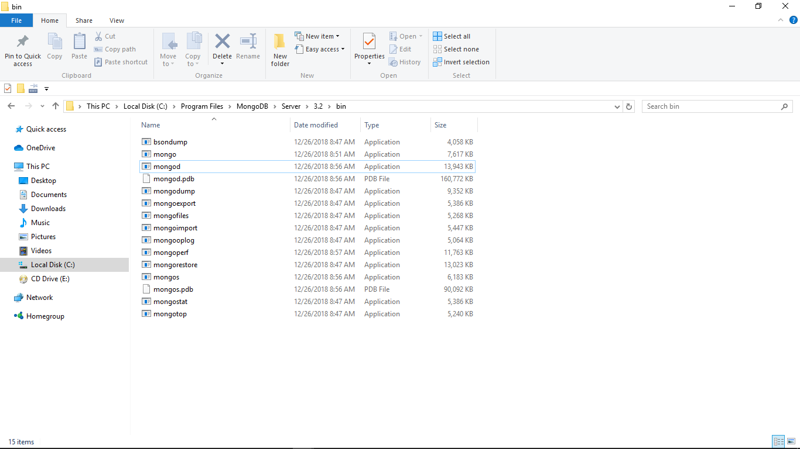
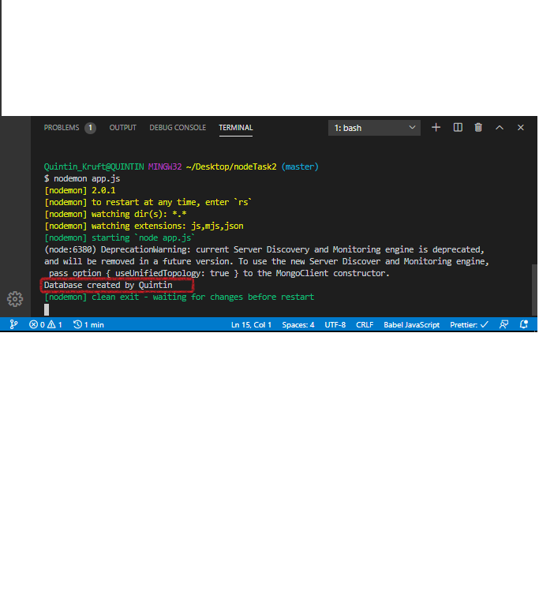
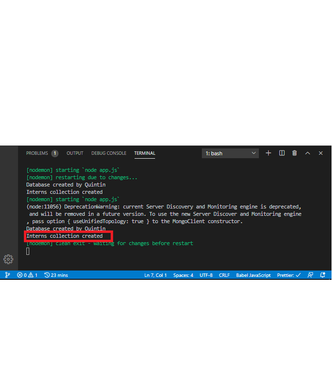

# Nodejs Task 2

Carried out the task as instructed. Herein are the screenshots requested

### Screenshot highlighting the mongod and mongo .exe files

### Screenshot indicating successful connection to Databse server

### Screenshot validating that interns collection was saved successfully

